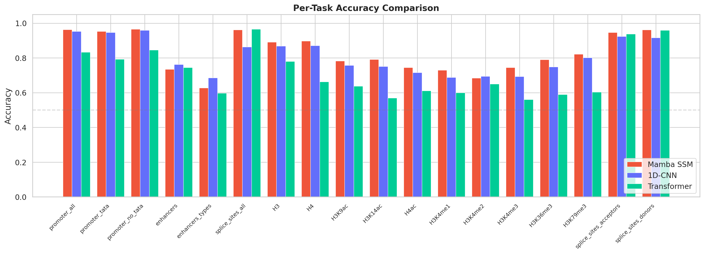
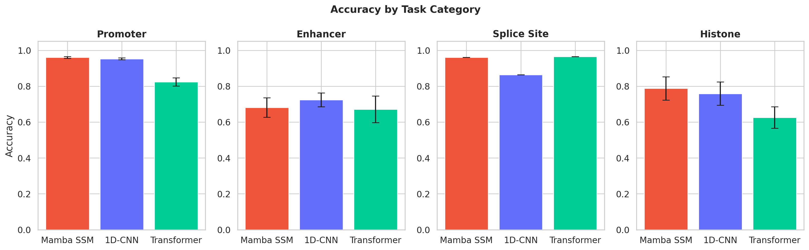
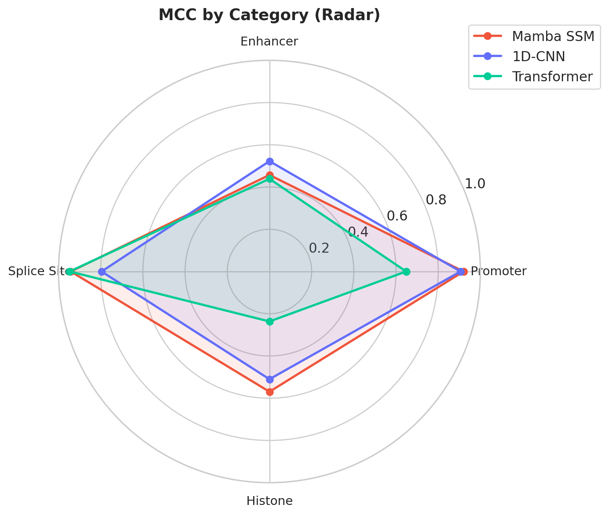
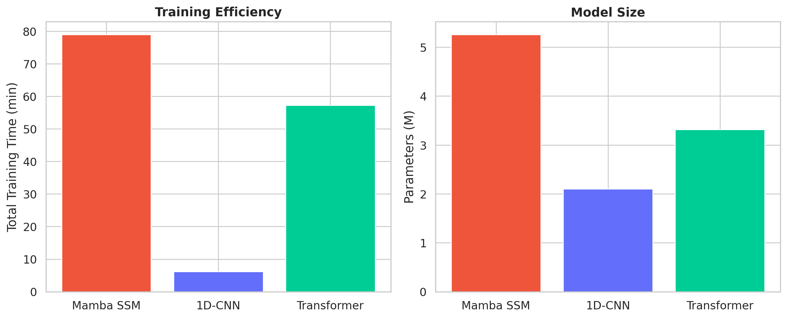

# Mamba SSM for Genomic Sequence Classification

A comprehensive benchmark of the **Mamba selective state space model** against CNN and Transformer baselines across **18 genomic sequence classification tasks** from the Nucleotide Transformer downstream benchmark.

Mamba achieves the highest average accuracy (**83.28%**) while maintaining efficient linear-time sequence processing, outperforming both 1D-CNN (81.09%) and Transformer (71.88%) architectures.

## Key Results

Evaluated on 18 tasks spanning promoter detection, enhancer classification, splice site prediction, and histone modification prediction:

| Architecture | Avg Accuracy | Avg MCC | Parameters | Total Train Time |
|-------------|-------------|---------|------------|-----------------|
| **Mamba SSM** | **83.28%** | **0.6671** | **5.26M** | 72.7 min |
| 1D-CNN | 81.09% | 0.6084 | 2.10M | 5.9 min |
| Transformer | 71.88% | 0.4766 | 3.32M | 53.6 min |

> Mamba wins on **15 of 18 tasks**, with the largest gains on histone modification prediction (+10-23% over Transformer) where long-range dependencies matter most.

### Per-Task Accuracy

<p align="center">
  
</p>

### Category-Level Summary

<p align="center">
  
</p>

### MCC by Task Category

<p align="center">
  
</p>

### Training Efficiency

<p align="center">
  
</p>

## Detailed Results

| Task | Mamba | CNN | Transformer | Best |
|------|-------|-----|-------------|------|
| promoter_all | **96.23** | 95.29 | 83.28 | Mamba |
| promoter_tata | **95.33** | 94.69 | 79.23 | Mamba |
| promoter_no_tata | **96.49** | 95.90 | 84.60 | Mamba |
| enhancers | 73.50 | **76.25** | 74.50 | CNN |
| enhancers_types | 62.75 | **68.50** | 59.75 | CNN |
| splice_sites_all | 96.13 | 86.37 | **96.50** | Trans |
| splice_sites_acceptors | **94.68** | 92.38 | 93.82 | Mamba |
| splice_sites_donors | **96.18** | 91.58 | 95.86 | Mamba |
| H3 | **89.11** | 86.84 | 77.96 | Mamba |
| H4 | **89.73** | 87.06 | 66.26 | Mamba |
| H3K9ac | **78.23** | 75.67 | 63.76 | Mamba |
| H3K14ac | **79.15** | 75.10 | 56.91 | Mamba |
| H4ac | **74.46** | 71.52 | 61.06 | Mamba |
| H3K4me1 | **72.95** | 68.75 | 59.97 | Mamba |
| H3K4me2 | 68.43 | **69.44** | 64.97 | CNN |
| H3K4me3 | **74.48** | 69.35 | 56.06 | Mamba |
| H3K36me3 | **78.96** | 74.80 | 59.00 | Mamba |
| H3K79me3 | **82.21** | 80.13 | 60.33 | Mamba |

## Architecture

```
┌─────────────────────────────────────────────────────────────────────┐
│                 Mamba Genomic Classifier                            │
├─────────────────────────────────────────────────────────────────────┤
│                                                                     │
│  Input: DNA Sequence "ACGTACGT...N"                                │
│         ↓                                                           │
│  ┌──────────────────────────────────────────────────────────────┐  │
│  │  Token Embedding  (vocab_size=6 → d_model=256)              │  │
│  │  A→1, C→2, G→3, T→4, N→5, PAD→0                           │  │
│  └──────────────────────────┬───────────────────────────────────┘  │
│                             ↓                                       │
│  ┌──────────────────────────────────────────────────────────────┐  │
│  │  Mamba Block ×12 (Selective State Space Model)               │  │
│  │  ┌────────────────────────────────────────────────────────┐  │  │
│  │  │  LayerNorm → Mamba SSM → Residual Add                 │  │  │
│  │  │                                                        │  │  │
│  │  │  Mamba SSM internals:                                  │  │  │
│  │  │  • Linear projection: d_model → expand × d_model      │  │  │
│  │  │  • Causal 1D convolution (d_conv=4)                    │  │  │
│  │  │  • Selective scan: Δ, B, C computed from input         │  │  │
│  │  │  • State space recurrence: h_t = Āh_{t-1} + B̄x_t     │  │  │
│  │  │  • Output: y_t = Ch_t (selective, input-dependent)     │  │  │
│  │  │  • Linear projection: expand × d_model → d_model      │  │  │
│  │  └────────────────────────────────────────────────────────┘  │  │
│  └──────────────────────────┬───────────────────────────────────┘  │
│                             ↓                                       │
│  ┌──────────────────────────────────────────────────────────────┐  │
│  │  LayerNorm → Masked Global Average Pooling                  │  │
│  │  (ignores padding tokens)                                    │  │
│  └──────────────────────────┬───────────────────────────────────┘  │
│  │  Dropout(0.1) → Linear(256 → num_classes)                  │  │
│  └──────────────────────────────────────────────────────────────┘  │
│         ↓                                                           │
│  Output: Class logits                                               │
│                                                                     │
└─────────────────────────────────────────────────────────────────────┘
```

## Why Mamba Excels at Genomics

1. **Linear-time complexity**: Mamba processes sequences in O(L) time vs O(L²) for attention, critical for long genomic sequences.

2. **Selective state space**: Unlike fixed convolution kernels (CNN) or uniform attention (Transformer), Mamba's state transitions are input-dependent — it can selectively remember or forget information based on the nucleotide content.

3. **Long-range dependencies**: Histone modification patterns depend on distant regulatory elements (enhancers, promoters). Mamba's state space formulation naturally captures these long-range interactions, explaining its 10-23% advantage over Transformers on histone tasks.

4. **Inductive bias for sequences**: The causal convolution + selective scan architecture is inherently suited for sequential biological data where local motifs (conv) and global context (SSM) both matter.

## Project Structure

```
mamba-genomic-classification/
├── configs/
│   └── default.yaml              # Training and model configuration
├── scripts/
│   ├── train.py                  # Train all models on all tasks
│   └── visualize.py              # Generate comparison plots
├── src/mamba_genomics/
│   ├── data/
│   │   └── dataset.py            # HuggingFace dataset loader + tokenizer
│   ├── models/
│   │   ├── mamba_classifier.py   # Mamba SSM classifier
│   │   ├── cnn_classifier.py     # 1D-CNN baseline
│   │   └── transformer_classifier.py  # Transformer baseline
│   └── utils/
│       └── config.py             # Configuration utilities
├── results/                      # Evaluation results & visualizations
└── logs/                         # Training logs
```

## Quick Start

### Prerequisites
- NVIDIA GPU with CUDA support (tested on RTX 4090, 24GB VRAM)
- Conda package manager

### Installation

```bash
git clone https://github.com/A-SHOJAEI/mamba-genomic-classification.git
cd mamba-genomic-classification

conda create -n mamba_genomics python=3.11 -y
conda activate mamba_genomics

# Install PyTorch (CUDA 12.4)
pip install torch==2.5.1 --index-url https://download.pytorch.org/whl/cu124

# Install Mamba SSM (builds CUDA kernels from source)
pip install mamba-ssm causal-conv1d --no-build-isolation

# Install remaining dependencies
pip install -r requirements.txt
```

### Training

```bash
# Train all three architectures on all 18 tasks
python scripts/train.py --model all

# Train specific model
python scripts/train.py --model mamba

# Train on specific tasks
python scripts/train.py --model mamba --tasks promoter_all H3 splice_sites_all
```

### Visualization

```bash
python scripts/visualize.py
```

## Dataset

The [Nucleotide Transformer Downstream Tasks](https://huggingface.co/datasets/InstaDeepAI/nucleotide_transformer_downstream_tasks) benchmark contains 18 binary/multi-class classification tasks across four categories:

| Category | Tasks | Seq Length | Description |
|----------|-------|------------|-------------|
| Promoter | 3 | 300 bp | Detect gene promoter regions |
| Enhancer | 2 | 200 bp | Identify enhancer elements |
| Splice Site | 3 | 400-600 bp | Predict splice sites in pre-mRNA |
| Histone | 10 | 500 bp | Predict histone modification marks |

Total: ~462K training sequences, ~49K test sequences. Downloaded automatically from HuggingFace.

## Training Configuration

| Parameter | Value |
|-----------|-------|
| Epochs | 10 |
| Batch size | 256 |
| Optimizer | AdamW (lr=1e-3, wd=0.01) |
| Scheduler | Cosine with 5% linear warmup |
| Mixed precision | bf16 |
| Gradient clipping | 1.0 |
| Max sequence length | 600 tokens |

## References

- Gu & Dao, [Mamba: Linear-Time Sequence Modeling with Selective State Spaces](https://arxiv.org/abs/2312.00752), 2023
- Schiff et al., [Caduceus: Bi-Directional Equivariant Long-Range DNA Sequence Modeling](https://arxiv.org/abs/2403.03234), ICML 2024
- Nguyen et al., [HyenaDNA: Long-Range Genomic Sequence Modeling at Single Nucleotide Resolution](https://arxiv.org/abs/2306.15794), NeurIPS 2023
- Dalla-Torre et al., [The Nucleotide Transformer](https://www.nature.com/articles/s41592-024-02523-z), Nature Methods 2024
- Zhou et al., [DNABERT-2: Efficient Foundation Model and Benchmark For Multi-Species Genome](https://arxiv.org/abs/2306.15006), ICLR 2024

## License

MIT License — see [LICENSE](LICENSE) for details.
